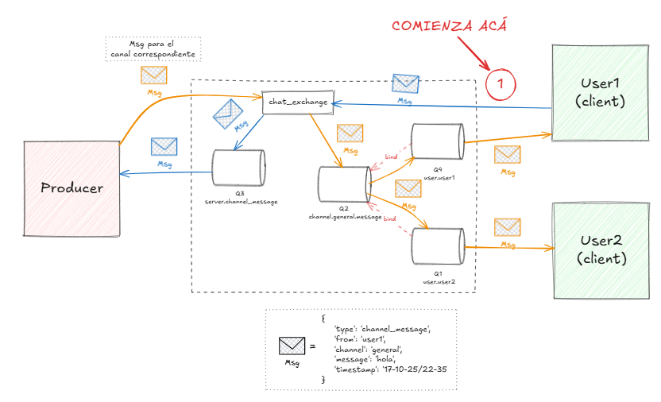

## Chat
Nos piden que desarrollemos una aplicación que permita:
- Soporte para múltiples canales
- Mensajes privados
- Enviar archivos
- Información perfil usuario
- Opción para guardar conversaciones
- Logging

### Cómo hacer andar
Este programa utiliza un broker para manejar las colas. Descargá [RabbitMQ acá](https://github.com/rabbitmq/rabbitmq-server/releases/download/v4.1.4/rabbitmq-server-4.1.4.exe). Y ponele start, buscás
en el buscador de windows `rabbitmq` seguro te aparece uno que dice start. De todas formas, en la instalación
también le podés poner a la final que lo comience ahora.

Ahora iniciá el servidor con `python chat_server.py` en una terminar y en 1 o más ejecutá `python chat_client.py` para
iniciar las instancias de clientes.

Si todo sale bien, te podés loguear, tiene comandos todo. Impresionante como avanza la tecnología.
### Como funciona amigo
Hice un dibujito para mostrarlo, vamos a verlo por partes. Cuando el usuario quiere enviar
un mensaje a un canal al que está suscripto:
1. Crea el mensaje con el tipo de mensaje, su nombre de usuario y el mensaje.
2. Envía el mensaje al exchange `chat_exchange`. Los _exchanges_ se aseguran de que el mensaje llegue a la cola correcta.
3. El servidor (Producer), quien está suscripto al canal `server.channel_message` donde se envían los mensajes, recibirá el mensaje. Por lo tanto, el mensaje dejará de estar en la cola.
4. El servidor procesa el mensaje para determinar a qué canal enviar el mensaje, logguear info y otras operaciones adicionales.
5. El servidor envía el mensaje al `chat_exchange` con el canal especificado.
6. El canal especificado fue `channel.general.message`, el _exchange_ encola el mensaje en la cola.
7. Cada usuario tiene una cola que hace bind de la cola `channel.general.message` para obtener una copia del mensaje. Entonces el mensaje será encolado en sus filas correspondientes `user.useri`.

Como podrá notar el lector experto, estoy cansado y me voy a dormir.