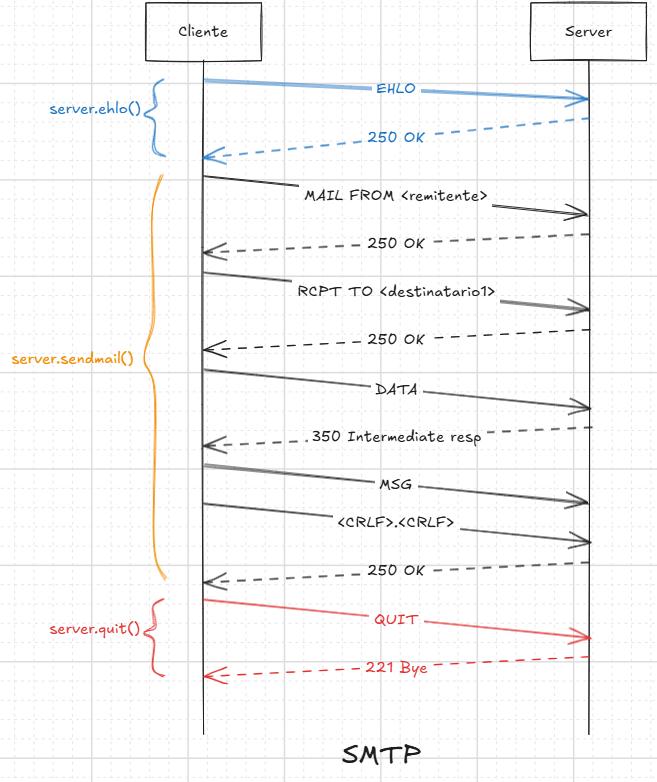
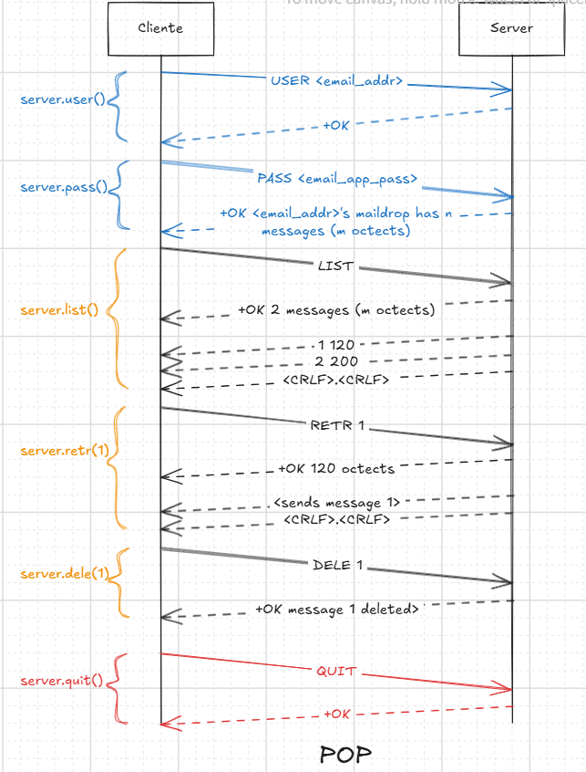
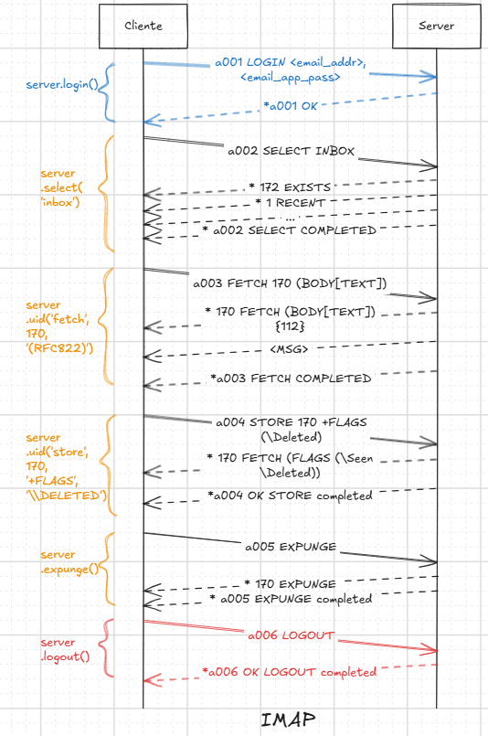

# Email Client

Cliente de correo que implementa las siguientes funcionalidades:
- Reenviar correos
- Responder correos
- Eliminar correos
- Búsqueda de correos por distintos criterios (cuerpo del mail, destinatario, etc).

## Configuración
Para utilizar el este cliente necesitás tu _dirección de correo_ (por ej. la de gmail) y una _contraseña de aplicación_.
Para conseguir tu _contraseña de aplicación_ en gmail tenés que:
1. Activar la [verificación en dos pasos](https://support.google.com/accounts/answer/185839?sjid=8773938299224853416-SA).
2. Crear tu [contraseña de aplicación acá](https://myaccount.google.com/apppasswords). Deberías conseguir una contraseña de esta forma `xxxx xxxx xxxx xxxx`, copiala.

Ahora abrí con un editor de texto el archivo `.env.example` y cambiá `EMAIL_ADDRESS` por tu dirección de correo electrónico y `EMAIL_PASSWORD` por la contraseña de aplicación que obtuviste.
Cambiá el nombre del archivo `.env.example` a `.env`.

Con esto ya podés correr el cliente, probarlo y ver desastre.

## Protocolos utilizados
Las funcionalidades se deben lograr con los protocolos STMP, IMAP y POP3. Python provee librerías estándar para
comunicarse utilizando cualquiera de los protocolos.
### SMTP
Es un _protocolo de transporte de correo electrónico_ que permite **enviar, reenviar y responder correos electrónicos**. Cuando se establece
la conexión TCP entre el cliente (_Mail User Agent_ o _MUA_) y servidor (_Mail Transport Agent_ o _MTA_), el flujo de mensajes para enviar un correo es el siguiente.

### POP 3
Este protocolo permite consultar la mailbox de un servidor de correo electrónico. Admite operaciones
para cosultar y eliminar. El protocolo consta de 3 estados importantes: autenticación, transacción y actualización.

En el estado de autenticación, el cliente debe autenticarse con su correo electrónico y contraseña. Lo realiza mediante los comandos `USER <email_addr>` y `PASS <email_app_pass`.

Una vez autenticado, pasa al estado de transacción. En el estado de transacción el cliente puede realizar operaciones de consulta o marcar mensajes para eliminar. Los mensajes
son identificados con un ID incremental de la sesión, donde 1 es el ID del mensaje más reciente. El ID del mensaje se utiliza
para las operaciones `RETR` para consultarlo y `DELE` para marcarlo para eliminar.

Del estado de autenticación se pasa al estado de actualización con el comando `QUIT`. En este estado, se commitean los cambios
realizados. El servidor responder con un mensaje de éxito o error.

### IMAP
Es un protocolo parecido a POP3, se diferencia en que permite clasificar los correos
en carpetas, permite búsquedas más avanzadas. Con `SELECT` seleccionas la carpeta con la que vas
a trabajar, como `inbox`, `spam`, etc. `SELECT` te va a devolver cierta información, pero para buscar dentro
del directorio tenés que hacer `SEARCH`, que te devuelve una lista de los correos electrónicos y sus UIDs.

Los correos electrónicos se identifican por su UID y tienen banderas como `deleted`, `seen`, etc. Para eliminar
un correo, colocás la bandera `deleted` con el comando `STORE` para el correo de un UID, luego hacés `EXPUNGE`.
`EXPUNGE` es como un commit, si hacés varios deletes seguidos, lo tenés que ejecutar a la final para commitear todos
los deletes.

## TODO
- [ ] Probar si anda todo
- [ ] Cómo integrar POP3?